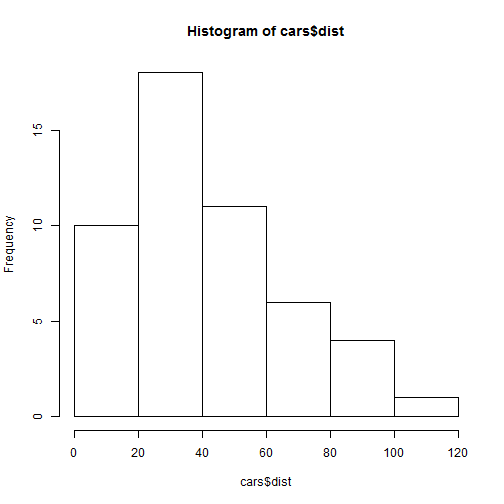
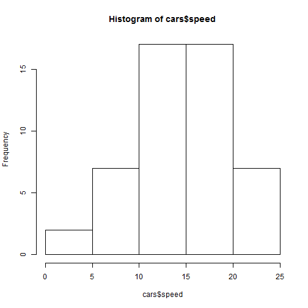

My shiny app presentation
========================================================
author: Alla Kolyban
autosize: true
date:Wed Dec 17 15:04:51 2014

Introduction to app
========================================================

This app presents a histogram, i.e. a graphical representation of the distribution of the data "Speed and Stopping Distances of Cars" and calculates MSE (mean squared error) for:

- Stopping Distances (Enter any desired distance in the checkbox and press submit button. The red line will move to that value through the histogram and app will calculate the MSE automatically);
- Speed (Enter any speed value to the checkbox and press submit button. The blue line will move to that value through the histogram and app will calculate the MSE automatically).

Data "Speed and Stopping Distances of Cars"
========================================================

"Description"

The data gives the speed of cars and the distances taken to stop. The data were recorded in the 1920s.

A data frame with 50 observations on 2 variables.
- Speed (numeric) (mph);
- Stopping distance (numeric) (ft).

Source -
Ezekiel, M. (1930) Methods of Correlation Analysis. Wiley.

References - 
McNeil, D. R. (1977) Interactive Data Analysis. Wiley

Histogram for stopping distance
========================================================

 

The mass of the destribution is concentrated on the left, thus distribution is right-skewed. In order to calculate MSE just enter the distance to the checkbox and press submit button. The app will calculate it automatically.

Histogram for speed
========================================================

 

The data for speed seems to be normally distributed. In order to calculate MSE just enter the distance to the textbox and press submit button. The app will calculate it automatically.
